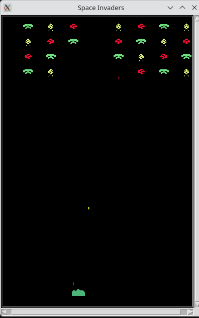

### Space invaders game
The classic game, invaders attack earth, you have to defend it!.

start with `uv run run`
and then `s`

This is an example on small screen:

Technology: Python (Turtle included)

**New Feature - Progressive Levels:**
- When all aliens are destroyed, the game automatically advances to the next level
- Each level increases screen size and adds more aliens
- Level 1: 4 rows × 8 columns
- Level 2: 5 rows × 10 columns
- And so on...

Controls:
- `Left` / `Right` - Move gun
- `Space` - Fire grenade
- `s` - Start / Restart game
- `q` - Quit

- 220726 updated folders structure (main in src/app) and added hook for black formatting (config in .git/hooks/pre-commit)

- 25.07.2026 added linter ruff

Lint: uv run ruff check . --fix
Format: uv run ruff format .